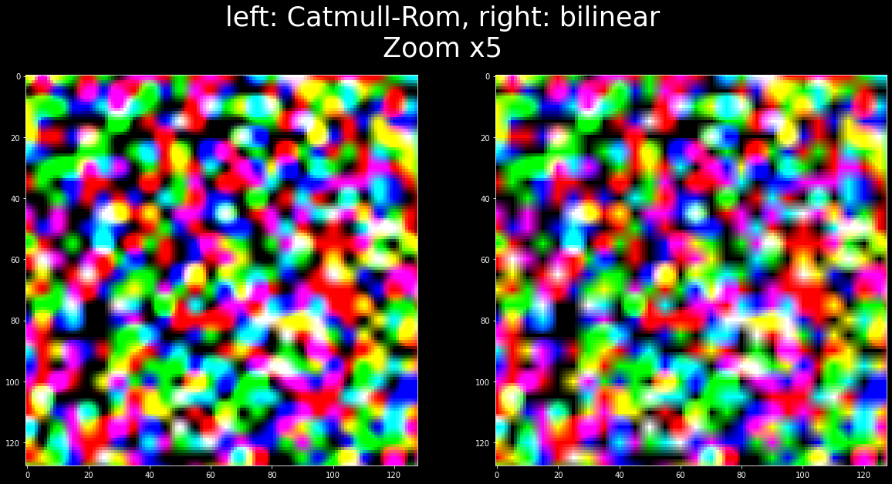

# 2D-catmull-rom-tensorflow
Perform catmull-rom interpolation on a list of query points on a 2D image

Usage is exactly the same as interpolate_bilinear from the tensorflow git: https://github.com/tensorflow/addons/blob/v0.14.0/tensorflow_addons/image/dense_image_warp.py

The notebook shows the difference between the bilinear interpolation and the Catmull-Rom interpolation. You can change the scale parameter to see different level of zooming. If you want to perform a different bicubic interpolation, feel free to change the weights in the code directly (w0 to w3). 

This implementation does not utilize the hardware bilinear interpolation feature, which could reduce the number of texture fetches from 16 to 4. If someone knows how to leverage texture memory and sampler in tensorflow, I'd like it. https://vec3.ca/bicubic-filtering-in-fewer-taps/

It is obviously slower and takes more memory than bilinear, but the quality is improved. This code can be useful when doing motion vector reprojection.

